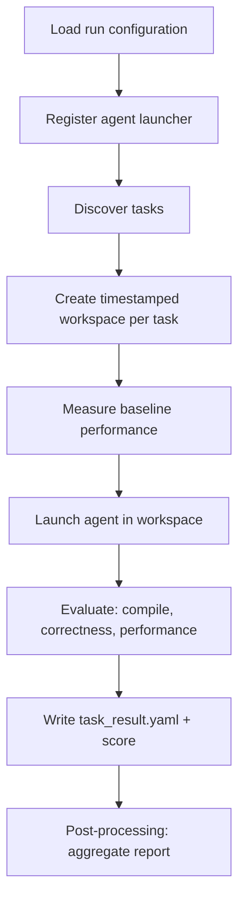

---
myst:
    html_meta:
        "description": "Configure and run a controlled AgentKernelArena experiment, resume interrupted work, and read RL-ready outcome signals."
        "keywords": "AgentKernelArena, A/B experiment, config.yaml, GPU kernel, ROCm, AMD, task results, resume run, reward, scoring"
---

# Run an experiment in AgentKernelArena

An experiment runs one agent configuration against a task set and produces
structured outcome and score signals. Repeat the run with one controlled change
to create an A/B comparison. This topic explains how to configure, execute,
resume, and inspect a run.

## Choose or create a run configuration

A run configuration selects the agent, tasks, and target GPU. The repository
ships three examples:

| Configuration | Purpose |
| --- | --- |
| `example_configs/quickstart_claude_mi300.yaml` | One Claude Code GELU task on MI300/MI300X (`gfx942`). |
| `example_configs/quickstart_claude_mi355x.yaml` | One Claude Code GELU task on MI355X (`gfx950`). |
| `example_configs/benchmark_cursor_mi355x.yaml` | Curated 60-task Cursor Agent benchmark on MI355X; use only after installing and authenticating Cursor Agent. |

For a first run, select the quickstart that matches the physical GPU:

```bash
CONFIG_PATH=example_configs/quickstart_claude_mi300.yaml
# For MI355X instead:
# CONFIG_PATH=example_configs/quickstart_claude_mi355x.yaml
```

Install and authenticate the agent named by the selected config, then verify it
inside the runtime container:

```bash
make docker-check-agents CONFIG="$CONFIG_PATH"
```

To define a different experiment, copy the nearest example and edit the copy:

```bash
cp "$CONFIG_PATH" my_experiment.yaml
CONFIG_PATH=my_experiment.yaml
```

For example, replace the contents of `my_experiment.yaml` with the following to
use Cursor Agent. Install and authenticate Cursor before selecting it:

```yaml
agent:
  template: cursor          # one agent template per run

tasks:
  - hip2hip/gpumode/GELU
  - triton2triton/vllm/triton_rms_norm
  # - hip2hip                 # all tasks under a category
  # - all                     # every available task

target_gpu_model: MI300
log_directory: logs
workspace_directory_prefix: workspace
```

### Select tasks

Each entry in `tasks` is a path relative to the `tasks/` directory. You can
select tasks at any level of granularity.

| Entry | Selects |
| --- | --- |
| `all` | Every task in `tasks/` |
| `hip2hip` | All tasks under `tasks/hip2hip/` |
| `triton2triton/vllm` | All tasks under that subdirectory |
| `hip2hip/gpumode/GELU` | A single task |

See [Configuration and API reference](../reference/api-reference.md) for the full
set of run-configuration fields.

## Start a run

```bash
make docker-run CONFIG="$CONFIG_PATH"
```

Use a non-default config file to keep multiple task sets side-by-side:

```bash
CONFIG_PATH=config_triton.yaml
make docker-run CONFIG="$CONFIG_PATH"
```

Add a suffix to label a run directory (useful for A/B testing):

```bash
make docker-run CONFIG="$CONFIG_PATH" RUN_ARGS="--run-suffix cursor_with_mcp"
# → workspace_MI300_cursor/run_20260617_101500_cursor_with_mcp
```

For debugging, enter the same Docker runtime used by the experiment:

```bash
make docker-shell
```

The Docker runner currently supports Codex, Claude Code, and Cursor Agent login
reuse from the host. It preflights the selected config before starting the run.
Matched Apex-versus-Codex runs also execute a fail-closed runtime-isolation
preflight and repeat it in every worker. The resulting stable security receipt is
part of `campaign_manifest.yaml`; a worker with different UID/capability/NNP,
seccomp/AppArmor/Yama, `bwrap`/Codex identity, managed-policy hash, namespace,
system-path remasking, or managed Codex sandbox behavior cannot join the run.
Formal `run` and `preflight` synchronously invoke the exact model-free command
`codex app-server --listen stdio://` in a private host-side root before starting a
model-bearing attempt. AKA stable-reads host authentication, forces a cache miss,
and never reads or mutates the user's host cloud-config cache. It validates envelope
shape, account identity, cache time, at least 630 seconds of remaining lifetime, and
a maximum two-hour issue-to-expiry lifetime; the pinned Codex CLI still owns
cryptographic signature verification. The complete host Codex/Node/package closure
is pinned and rechecked around generation.

The supervisor publishes only private `auth.json` and
`cloud-config-bundle-cache.json`, then refreshes at expiry minus ten minutes. The
comparison contract binds the canonical `signed_payload.bundle` SHA-256 across both
arms. A scheduled envelope is published only when that digest remains unchanged;
bundle or host-runtime drift preserves the last good cache, terminates the formal
owner, and produces exit status 71. Immutable refresh receipts expose only policy,
status, timing, hashes, and byte sizes—not account, token, signature, or config
payloads. The campaign manifest binds the initial receipt; the later scheduled
receipt chain is supervisor evidence and is not yet linked into every attempt.

`docker-check-agents` performs a private diagnostic refresh, but that disposable
receipt does not establish a campaign anchor. If the bundle changes, stop both arms
and initialize a new matched campaign.
The two formal runs' normalized YAML documents may differ only in the exact
`agent.template` treatment (`apex` versus `codex`); comments and formatting are
not semantic differences. AKA removes that one mapping, binds every other normalized
field into the comparison contract, and separately binds each raw YAML SHA-256. A
difference in tasks or ordering, attempt policy, GPU target,
workspace/output path, log path, or any other run setting makes the arms
incomparable. Campaign execution, postprocessing, and comparison each re-read this
evidence and fail closed if the original config was changed or removed.
Each direct attempt creates a private PID namespace and private procfs, pins its
namespace init with a pidfd, and proves the worker PID namespace is absent by inode
identity rather than numeric PID. Parent root/fd probes compare secret bytes, so a
PID-number collision cannot pass. The managed Codex profile is tested
separately for workspace write access, credential-read denial, and command-network
denial. A content-pinned bubblewrap shim is transported through a sealed memfd and
mounted beneath a dedicated read-only mountpoint before it restores only
Docker-approved KFD/render devices inside Codex's private `/dev`. The probe
requires rename/unlink/replace/write attacks against that path to fail and
requires the command to remain outside the worker PID namespace, blocks PID-1
root/environ/mem credential aliases, exposes exactly one ROCm device, and completes
a Torch allocation plus reduction on that GPU.

Comparison-contract v4 fixes both the outer attempt and backend-agent policy fields
to `private_pid_namespace_init_pidfd_v1`. At turn 50,
Direct Codex kills the pidfd-pinned namespace init and freezes source only after the
kernel teardown, wrapper status/EOF, stream EOF, and a completed scan with no
supervisor-visible namespace member. The receipt separately records inaccessible
sibling `/proc` entries and never calls such a scan complete; pidfd-pinned namespace
init exit remains the authoritative teardown proof. This contains `setsid`,
double-fork, clear-environment, immediate-exec, and
late-writer descendants without trusting PGIDs or `/proc` polling identities. The
Apex arm uses an AKA outer namespace around its trusted orchestrator and a separate
Apex-owned private procfs/namespace around the backend; both teardown receipts are
required before a bundle is read. The outer inherited procfs is writable only so
Apex can create the nested user namespace; the backend sees only Apex's remasked
private procfs. Apex's `apex.agent-invocation/v3`,
`apex.agent-transcript/v3`, event payload, and candidate-persistence digest must all
bind the same `apex.agent-process-containment/v1` receipt. Turn 49 is not an exact checkpoint; turn 51,
timeout, output truncation, a live namespace member, or fallback cleanup is rejected.
Central Arena evaluation remains the scoring authority, and a successful session
with no independently recomputed source delta is a non-scoreable baseline replay.

## Run across multiple GPUs

Use `make docker-parallel-run` when a server has multiple GPUs and the task set
is large enough to keep them busy. The parallel runner starts one Docker worker
container per GPU, masks each worker to one GPU, and lets workers claim tasks
from a shared queue:

```bash
make docker-parallel-run CONFIG="$CONFIG_PATH" GPU_IDS=0,1,2,3,4,5,6,7
```

If `GPU_IDS` is omitted, the runner discovers GPU IDs with `rocm-smi --showid`:

```bash
make docker-parallel-run CONFIG="$CONFIG_PATH"
```

`RUN_ARGS` works the same way as `docker-run`:

```bash
make docker-parallel-run \
  CONFIG="$CONFIG_PATH" \
  GPU_IDS=0,1 \
  RUN_ARGS="--run-suffix parallel_smoke"
```

The Docker parallel path is verified for `cursor`, `claude_code`, `codex`, and
`task_validator`. Specialized GEAK/mini-swe templates require their own
dependencies and worker-visible GPU configuration. See
[Run tasks in parallel across multiple GPUs](parallel-run.md) for scheduling,
GPU isolation, resume behavior, and failure handling.

## What happens during a run



For each task, the framework:

1. Copies the task into an isolated, timestamped workspace.
2. Measures a *baseline* (compiles and times the original kernel; for
   `torch2hip` tasks it times the PyTorch reference directly).
3. Launches the configured agent with a generated prompt.
4. Evaluates the agent's kernel for compilation, correctness, and performance.
5. Writes a standardized `task_result.yaml` and computes a score.

After all tasks finish, a post-processing step aggregates the per-task results
into a run report.

`task_validator` uses a separate path: it skips baseline measurement and kernel
scoring, writes `validation_report.yaml` per task, and aggregates a
`validation_summary.yaml`.

Run the same configuration again with one agent capability changed and a new
`--run-suffix` to form a controlled A/B pair. See
[Configure agents and models](agents.md#ab-testing-and-ablation-studies).

## Resume an interrupted run

Long runs can be resumed; completed tasks are skipped.

For a formal Codex resume, AKA creates a fresh private supervisor, performs a new
model-free refresh, and admits the resume only when the refreshed canonical bundle
matches the sealed campaign anchor. Bundle or pinned host-runtime closure drift
fails closed; start a new matched Apex/Codex cohort rather than resuming one arm.

```bash
# Resume a specific run directory
make docker-run CONFIG="$CONFIG_PATH" RUN_ARGS="--resume-run run_20260617_101500"

# Resume the most recent run
make docker-run CONFIG="$CONFIG_PATH" RUN_ARGS="--resume-latest"
```

For a parallel run, use the same `RUN_ARGS` with `docker-parallel-run`:

```bash
make docker-parallel-run CONFIG="$CONFIG_PATH" GPU_IDS=0,1,2,3 RUN_ARGS="--resume-latest"
```

## Read the results

A run produces this layout under the workspace directory:

```text
workspace_<gpu>_<agent>/
└── run_<timestamp>/
    ├── .parallel/              # present for docker-parallel-run
    │   ├── pending/
    │   ├── running/
    │   ├── done/
    │   └── failed/
    ├── <task_name>_<timestamp>/
    │   ├── task_result.yaml      # per-task outcome + reward/score
    │   └── ...                   # modified source and task artifacts
    └── reports/
        ├── overall_summary.csv
        ├── task_type_breakdown.json
        └── overall_report.txt
```

Each `task_result.yaml` contains the scored outcome:

```yaml
task_name: hip2hip/gpumode/GELU
pass_compilation: true
pass_correctness: true
base_execution_time: 1.82        # ms
best_optimized_execution_time: 1.15
speedup_ratio: 1.58
optimization_summary: "..."
score: 278.0
```

The `score` combines compilation, correctness, and speedup and can be consumed
as a reward by an external policy-search or RL system. See
[Configuration and API reference](../reference/api-reference.md#scoring) for the
scoring formula, and [Visualize and compare runs](visualization.md) to render and
compare reports across agents.
